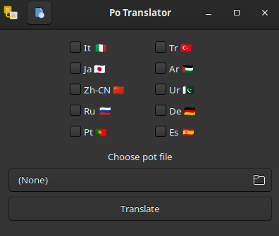

# Po Translator

## Some screenshots

Po Translator translate your application with using pot file.

You only need to choose langs and pot then it will be translated for you.

If you want to update pot file with your files you can use `po_translator_terminal.py`.

## It will have

* updating pot file with your files with ui
* adding package
* building a flatpack and deb package